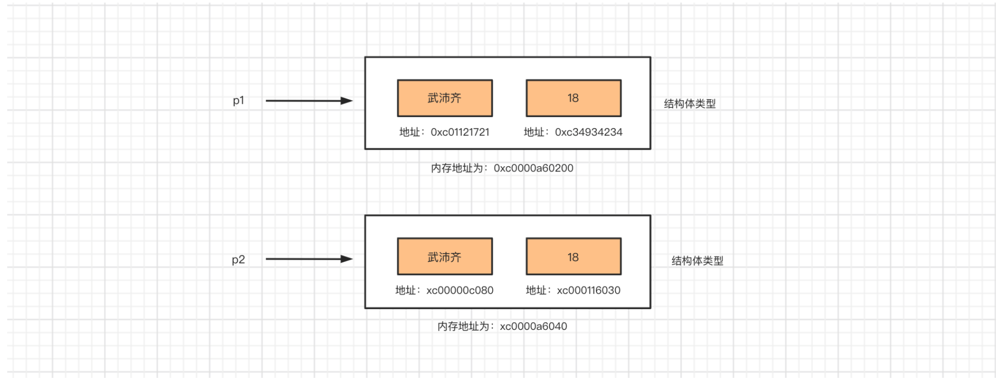
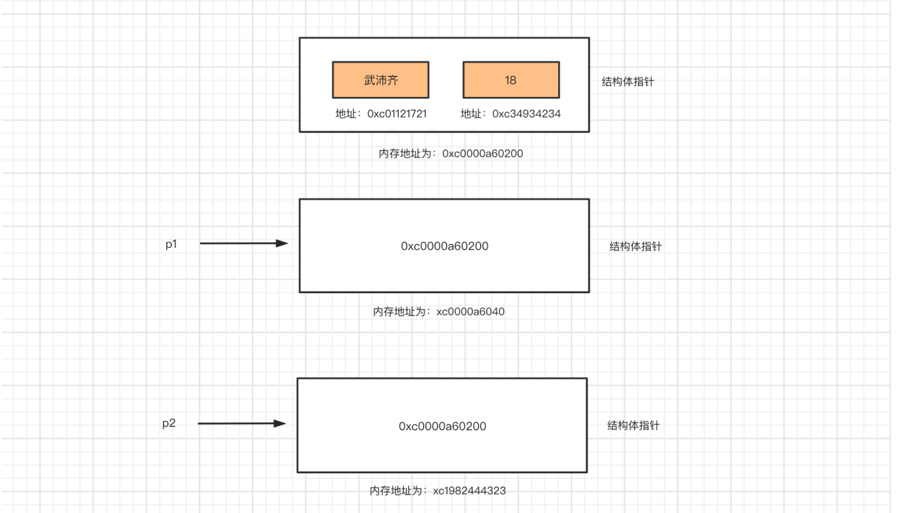
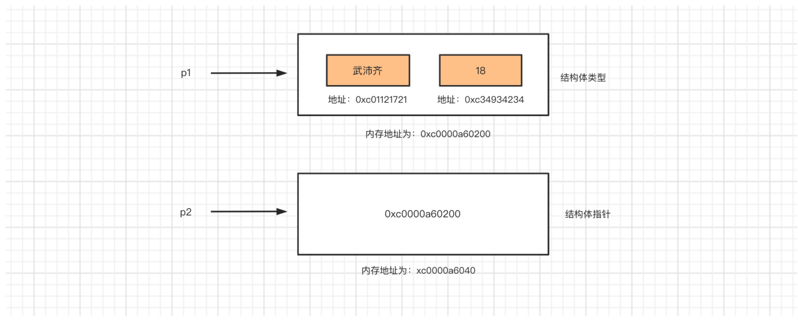

# day07 数据类型

Go语言中常见的数据类型有很多，例如：

- <span style="color:gray">整型，用于表示整数。</span>
- <span style="color:gray">浮点型，用于表示小数。</span>
- <span style="color:gray">布尔型，用于表示真/假。</span>
- <span style="color:gray">字符串，用于表示文本信息。</span>
- <span style="color:gray">数组，用于表示多个数据（数据集合）</span>
- <span style="color:gray">指针，用于表示内存地址的类型。</span>
- <span style="color:gray">切片，用于表示多个数据（数据集合）</span>
- <span style="color:gray">字典，用于表示键值对结合。</span>
- **结构体，用于自定义一些数据集合。**
- **接口，用于约束和泛指数据类型。**

## 今日概要

- 结构体，用于自定义一些数据集合。
- 接口，用于约束和泛指数据类型。


## 1.结构体

什么是结构体？

> 结构体是一个复合类型，用于表示一组数据。
>
> 结构体由一系列属性组成，每个属性都有自己的类型和值。

```go
// 定义
type Person struct {
    name  string
    age   int
    email string
}

// 初始化
var p1 = Person{"武沛齐", 19, "wupeiqi@live.com"}

// 结构体中取值
fmt.Println(p1.name, p1.age, p1.email)

p1.age = 20

fmt.Println(p1.name, p1.age, p1.email)
```

```go
type 结构体名称 struct {
    字段 类型
    ...
}
```


### 1.1 定义

```go
type Person struct {
    name  string
    age   int
    hobby []string
}
```

```go
type Address struct {  
    city,state string
    age int
}
```

```go
type Address struct {  
    city,state string
}

type Person struct {  
    name string
    age int
    ad Address
}
```

```go
type Address struct {
    city, state string
}

type Person struct {
    name    string
    age     int
	Address // 匿名字段 Address Address
}
```


### 1.2 初始化

或称根据结构体创建一个对象。

```go
// 定义一个结构体（类型），每个结构体包含 name、age、hobby 三个元素
type Person struct {
    name  string
    age   int
    hobby []string
}

//方式1：先后顺序
var p1 = Person{"武沛齐", 19, []string{"篮球", "足球"}}
fmt.Println(p1.name, p1.age, p1.hobby)

//方式2：关键字
var p2 = Person{name: "武沛齐", age: 19, hobby: []string{"饺子", "嫂子"}}
fmt.Println(p2.name, p2.age, p2.hobby)

//方式3：先声明再赋值
var p3 Person
p3.name = "武沛齐"
p3.age = 18
p3.hobby = []string{"女人", "篮球"}
fmt.Println(p3.name, p3.age, p3.hobby)

```

```go
type Address struct {  
    city,state string
    age int
}
// 同上
```

```go
type Address struct {  
    city,state string
}
type Person struct {  
    name string
    age int
    address Address
}

//方式1：先后顺序
var p1 = Person{"武沛齐", 19, Address{"北京", "中国"}}
fmt.Println(p1.name, p1.age, p1.address.city, p1.address.state)

//方式2：关键字
var p1 = Person{name: "武沛齐",age: 19, address: Address{city: "北京", state: "中国"}}
fmt.Println(p1.name, p1.age, p1.address.city, p1.address.state)

//方式3：先声明再赋值
var p3 Person
p3.name = "武沛齐"
p3.age = 50
p3.address = Address{
    city:  "北京",
    state: "BJ",
}
fmt.Println(p3.name, p3.age, p3.address.city, p3.address.state)

```

```go
// 定义一个结构体（类型），每个结构体包含 name、age、hobby 三个元素
type Address struct {
    city, state string
}
type Person struct {
    name    string
    age     int
    Address // 匿名字段，那么默认Person就包含了Address的所有字段
}

//方式1：先后顺序
p1 := Person{"武沛齐", 19, Address{"北京", "中国"}}
fmt.Println(p1.name, p1.age, p1.city, p1.state)


//方式2：关键字
p2 := Person{name: "武沛齐", age: 19, Address: Address{city: "北京", state: "中国"}}
fmt.Println(p2.name, p2.age, p2.city, p2.state,p2.Address.city, p2.Address.state)

//方式3：先声明再赋值
var p3 Person
p3.name = "武沛齐"
p3.age = 50
p3.Address = Address{
    city:  "北京",
    state: "BJ",
}
fmt.Println(p3.name, p3.age, p3.address.city, p3.address.state)
// 或
var p4 Person
p4.name = "武沛齐"
p4.age = 50
p4.city = "北京"
p4.state = "BJ"
fmt.Println(p3.name, p3.age, p3.Address.city, p3.Address.state)
```


### 1.3 结构体指针

#### 1.3.1 创建

```go
type Person struct {
    name  string
    age   int
}

// 初始化结构体（创建一个结构体对象）
p1 := Person{"武沛齐", 18}
fmt.Println(p1.name, p1.age)

// 初始化结构体指针
// var p2 *Person = &Person{"武沛齐", 18}
p2 := &Person{"武沛齐", 18}
fmt.Println(p2.name, p2.age)

var p3 *Person = new(Person)
p3.name = "武沛齐"
p3.age = 18

fmt.Println(p3.name, p3.age)
```


#### 1.3.2 内存管理

```go
type Person struct {
    name  string
    age   int
}

// 初始化结构体
p1 := Person{"武沛齐", 18}
fmt.Println(p1.name, p1.age)

// 初始化结构体指针
p2 := &Person{"武沛齐", 1}
fmt.Println(p2.name, p2.age)
```


### 1.4 赋值

#### 1.4.1 赋值拷贝

```go
type Person struct {
    name string
    age  int
}

p1 := Person{name: "武沛齐", age: 18}
p2 := p1 // 内部将p1重新拷贝一份

fmt.Println(p1) // {武沛齐 18}
fmt.Println(p2) // {武沛齐 18}

p1.name = "alex"

fmt.Println(p1) // {alex 19}
fmt.Println(p2) // {武沛齐 19}
```




#### 1.4.2 结构体指针赋值

```go
type Person struct {
    name string
    age  int
}

p1 := &Person{"武沛齐", 18}
p2 := p1

fmt.Println(p1) // &{武沛齐 18}
fmt.Println(p2) // &{武沛齐 18}
p1.name = "alex"
fmt.Println(p1) // &{alex 18}
fmt.Println(p2) // &{alex 18}
```




基于结合结构体和结构体指针的特性，基于指针实现数据变化后同步遍布。

```go
type Person struct {
    name string
    age  int
}

p1 := Person{name: "二狗子", age: 19}
p2 := &p1

fmt.Println(p1) // {二狗子 19}
fmt.Println(p2) // &{二狗子 19}

p1.name = "alex"

fmt.Println(p1) // {alex 19}
fmt.Println(p2) // &{alex 19}
```




#### 1.4.3 嵌套赋值拷贝

在存在结构体嵌套时，赋值会拷贝一份所有的数据。

```go
type Address struct {
	city, state string
}

type Person struct {
	name    string
	age     int
	address Address
}

p1 := Person{name:"二狗子",age:19,address: Address{"北京", "BJ"}}
p2 := p1

fmt.Println(p1.address) // {"北京" "BJ"}
fmt.Println(p2.address) // {"北京" "BJ"}

p1.address.city = "上海"

fmt.Println(p1.address) // {"上海" "BJ"}
fmt.Println(p2.address) // {"北京" "BJ"}
```


#### 1.4.4 谁不拷贝？

其实本质上都拷贝了，只不过由于数据存储方式的不同，导致拷贝的有些是数据，有些是内存地址（指针）。

- 感觉拷贝：字符串、数组、整型等。
- 感觉不拷贝：map、切片。

```go
/*
 @Author:武沛齐  微信号：wupeiqi666
 @Description: 老男孩IT教育 & 路飞学城
 @Video:  https://space.bilibili.com/283478842
*/
package main

import "fmt"

func main() {

	type Person struct {
		name    string
		age     int
		hobby   [2]string
		num     []int
		parent  map[string]string
	}

	p1 := Person{
		name:   "二狗子",
		age:    19,
		hobby:  [2]string{"裸奔", "大保健"}, // 拷贝
		num:    []int{69, 19, 99, 38}, // 未拷贝 (内部维护指针指向数据存储的地方)
		parent: map[string]string{"father": "Alex", "mother": "Monika"}, // 未拷贝 (内部维护指针指向数据存储的地方)
	}
	p2 := p1

	fmt.Println(p1)
	fmt.Println(p2)
	p1.parent["father"] = "武沛齐"
	fmt.Println(p1)
	fmt.Println(p2)
}
```


注意：对于那些默认拷贝的情况，可以改变为指针类型，让数据实现同步修改。

```go
type Address struct {
    city, state string
}
type Person struct {
    name    string
    age     int
    hobby   *[2]string
    num     []int
    parent  map[string]string
    address Address
}

p1 := Person{
    name:   "二狗子",
    age:    19,
    hobby:  &[2]string{"裸奔", "大保健"},
    num:    []int{69, 19, 99, 38},
    parent: map[string]string{"father": "Alex", "mother": "Monika"},
}
p2 := p1
p1.hobby[0] = "洗澡"

fmt.Println(p1.hobby) // &[洗澡 大保健]
fmt.Println(p2.hobby) // &[洗澡 大保健]
```


### 1.5 结构体标签

```go
/*
 @Author:武沛齐  微信号：wupeiqi666
 @Description: 老男孩IT教育 & 路飞学城
 @Video:  https://space.bilibili.com/283478842
*/
package main

import (
	"fmt"
	"reflect"
)

func main() {
	type Person struct {
		name string "姓名"
		age  int32  "年龄"
		blog string "博客"
	}

	p1 := Person{name: "武沛齐", age: 18, blog: "https://www.pythonav.com"}

	p1Type := reflect.TypeOf(p1)
    
	// 方式1
	filed1 := p1Type.Field(0)
	fmt.Println(filed1.Tag) // 姓名   filed1.Name -> name

	// 方式2
	filed2, _ := p1Type.FieldByName("blog")
	fmt.Println(filed2.Tag) // 

	// 循环获取
	fieldNum := p1Type.NumField() // 总共有多少个字段 3
    // 循环：0 1 2 
	for index := 0; index < fieldNum; index++ {
		field := p1Type.Field(index)
		fmt.Println(field.Name, field.Tag) //    name  姓名;    age 年龄  ;   blog 博客
	}
}
```

### 1.6 练习题

1. 创建学校结构体，并添加到切片中。

   > 创建一个学校的结构体，根据用户输入去创建学校（学校包含品牌 和 城市），然后将创建的学校信息动态添加到一个切片中。

   ```go
   /*
    @Author:武沛齐  微信号：wupeiqi666
    @Description: 老男孩IT教育 & 路飞学城
    @Video:  https://space.bilibili.com/283478842
   */
   package main
   
   import "fmt"
   
   type School struct {
   	band string
   	city string
   }
   
   func main() {
   	var schoolList []School
   	for{
   		// 用户输入品牌和城市
   		var band,city string
   		fmt.Printf("请输入品牌：")
   		fmt.Scanf("%s",&band)
   		if band == "Q"{
   			break
   		}
   		fmt.Printf("请输入城市：")
   		fmt.Scanf("%s",&city)
   		// 创建一个结构体对象
   		sch := School{band: band,city: city}
   		// 把结构体对象放到切片中
   		schoolList = append(schoolList,sch)
   	}
   	fmt.Println(schoolList) // [{路飞学成 北京} {luffy 上海}]
   }
   
   ```

2. 创建班级，并展示班级信息

   > 创建学校和班级的结构体，默认创建一个学校对象。
   >
   > 根据用户输入去创建班级（包含班级名称和人数），然后将创建的班级信息动态添加到一个切片中。

   ```go
   /*
    @Author:武沛齐  微信号：wupeiqi666
    @Description: 老男孩IT教育 & 路飞学城
    @Video:  https://space.bilibili.com/283478842
   */
   package main
   
   import "fmt"
   
   type School struct {
   	band string
   	city string
   }
   
   type Class struct {
   	title  string
   	count  int
   	school *School
   }
   
   func main() {
   	// 1.创建学校
   	sch := &School{"路飞学城", "北京"}
   
   	// 2.创建两个班级
   	c1 := Class{"Python1", 80, sch}
   	c2 := Class{"Python2", 70, sch}
   
   	c1.school.band = "老男孩"
   
   	fmt.Println(c1.school, c2.school)
   }
   
   ```

   ```go
   /*
    @Author:武沛齐  微信号：wupeiqi666
    @Description: 老男孩IT教育 & 路飞学城
    @Video:  https://space.bilibili.com/283478842
   */
   package main
   
   import "fmt"
   
   type School struct {
   	band string
   	city string
   }
   
   type Class struct {
   	title  string
   	count  int
   	school *School
   }
   
   func main() {
   	// 1.创建学校
   	sch := &School{"路飞学城", "北京"}
   
   	var classList []Class
   	// 2.循环创建班级
   	for{
   		// 用户输入品牌和城市
   		//var title string
   		//var count int
   		var cls Class
   		fmt.Printf("请输入班级：")
   		fmt.Scanf("%s",&cls.title)
   		if cls.title == "Q"{
   			break
   		}
   		fmt.Printf("请输入人数：")
   		fmt.Scanf("%d",&cls.count)
   
   		// 创建班级对象
   		cls.school = sch
   
   		// 加入到班级的列表（切片）
   		classList = append(classList,cls)
   	}
   	fmt.Println(classList) // [{python1 10 0xc00000c060} {python2 90 0xc00000c060}]
   
   	for _,item := range  classList{
   		message := fmt.Sprintf("%s%s 校区，%s 班级有%d多学生。",item.school.band,item.school.city,item.title,item.count)
   		fmt.Println(message)
   	}
   }
   
   ```


### 注意：稍后再补充

结构体暂时先讲这么多。

接下来学点 函数 的知识，然后再给大家补充结构体部分的内容（该部分内容需要大家先理解什么时候函数）。


## 2.函数

可以把函数当做一个代码块，用于实现某个功能。并且提高代码的重用性和可读性。

```go
/*
 @Author:武沛齐  微信号：wupeiqi666
 @Description: 老男孩IT教育 & 路飞学城
 @Video:  https://space.bilibili.com/283478842
*/
package main

import "fmt"

// 定义函数
func SendEmail()  {
	fmt.Println("发送邮件了...")
}

func main() {
	// 1000行 or 10000行
	// ...
	// 执行函数
	SendEmail()
	// ...
	// 10行代码可以实现发邮件
}
```

```go
func 函数名(参数) 返回值 {
    函数体
}
```

```go
package main

import "fmt"

func SendEmail(email string) bool {
   fmt.Println(email, "你有新邮件来了")
   return true
}

func main() {
   result := SendEmail("wupeiqi@qq.com")
   if result {
      fmt.Println("发送成功")
   } else {
      fmt.Println("发送失败")
   }
}
```

关于函数名需要注意：函数名只能是字母数字下划线组合且数字不能开头（驼峰式命名 `SendEmail` `sendEmail`）。

### 2.1 参数

#### 2.1.1 多个参数

```go
package main

import "fmt"

func add(num1 int, num2 int) (int, bool) {
   result := num2 + num1
   return result, true
}

func main() {
   data, flag := add(1, 8)
   fmt.Println(data, flag)
}

>>> 输出：
9 true
```

注意：传值时会拷贝一份数据（等同于赋值拷贝）。

```go
/*
 @Author:武沛齐  微信号：wupeiqi666
 @Description: 老男孩IT教育 & 路飞学城
 @Video:  https://space.bilibili.com/283478842
*/
package main

import "fmt"

func SendEmail(arg [2]int)  {
	arg[0] = 666
}

func main() {
	dataList := [2]int{11,22}
	SendEmail(dataList)
	fmt.Println(dataList) // [11,22]
}
```

```go
/*
 @Author:武沛齐  微信号：wupeiqi666
 @Description: 老男孩IT教育 & 路飞学城
 @Video:  https://space.bilibili.com/283478842
*/
package main

import "fmt"

func SendEmail(arg *[2]int)  {
	arg[0] = 666
}

func main() {
	dataList := [2]int{11,22}
	SendEmail(&dataList)
	fmt.Println(dataList) // [666,22]
}

```

```go
/*
 @Author:武沛齐  微信号：wupeiqi666
 @Description: 老男孩IT教育 & 路飞学城
 @Video:  https://space.bilibili.com/283478842
*/
package main

import "fmt"

func SendEmail(arg []int)  {
	arg[0] = 666
}

func main() {
	dataList := []int{11,22}
	SendEmail(dataList)
	fmt.Println(dataList) // [666,22]
}
```

#### 2.1.2 指针参数

```go
package main

import "fmt"

func changeData(dataList *[3]string) {
	dataList[1] = "李杰"
}

func main() {
	userList := [3]string{"武沛齐", "Alex", "老妖"}
	changeData(&userList)

	fmt.Println(userList)
}

>>> 输出：
[武沛齐 李杰 老妖]
```

数组是值类型，参数传递时会重新拷贝一份，为了避免拷贝可以使用指针类型做参数。

#### 2.1.3 函数做参数

```go
package main

import "fmt"

func add100(arg int) (int,bool) {
	return arg + 100, true
}

func proxy(data int, exec func(int) (int, bool)) int {
	data, flag := exec(data)
	if flag {
		return data
	} else {
		return 9999
	}
}

func main() {
	result := proxy(123, add100)
	fmt.Println(result) // 223

}
```

```go
package main

import "fmt"

func add100(arg int) (int, bool) {
   return arg + 100, true
}

type f1 func(arg int) (int, bool)

func proxy(data int, exec f1) int {
   data, flag := exec(data)
   if flag {
      return data
   } else {
      return 9999
   }
}

func main() {
   result := proxy(123, add100)
   fmt.Println(result)

}
```


#### 2.1.4 变长参数

```go
package main

import "fmt"

func do(num ...int) int {
   sum := 0
   for _, value := range num {
      sum += value
   }
   return sum
}

func main() {
   r1 := do(1, 2, 3, 3)
   r2 := do(0, 1, 1)
   fmt.Println(result)
}
```

注意事项：边长参数只能放在最后且只能有一个。


### 2.2 返回值

#### 2.2.1 多个返回值

```go
package main

import "fmt"

func add100(arg int) (int, bool, int) {
   return arg + 100, true, 888
}

func main() {
   v1, v2, v3 := add100(555)
   fmt.Println(v1, v2, v3)
}
```

#### 2.2.1 返回函数

```go
package main

import (
	"fmt"
)

func exec(num1 int, num2 int) string {
	fmt.Println("执行函数了")
	return "成功"
}

type f1 func(int, int) string

func getFunction() f1 {
	return exec
}

func main() {
	function := getFunction()
	result := function(111, 222)
	fmt.Println(result)
}

```

#### 2.2.2 匿名函数&返回函数

```go
/*
 @Author:武沛齐  微信号：wupeiqi666
 @Description: 老男孩IT教育 & 路飞学城
 @Video:  https://space.bilibili.com/283478842
*/
package main

import "fmt"

func F1(n1 int, n2 int) func(int) string {

	return func(n1 int) string {
		fmt.Println("匿名函数")
		return "匿名"
	}
}

func main() {
	// 匿名函数
	v1 := func(n1 int, n2 int) int {
		return 123
	}
	data := v1(11, 22)
	fmt.Println(data)

	value := func(n1 int, n2 int) int {
		return 123
	}(11, 22)
	fmt.Println(value)

}
```

```go
package main

import "fmt"

func proxy() func() int {
	v1 := func() int {
		return 100
	}
	return v1
}

func main() {
	function := proxy()
	result := function()
	fmt.Println(result)
}
```


### 2.3 闭包

学函数，少不了闭包。下面用两个示例了解闭包的作用。

```go
/*
 @Author:武沛齐  微信号：wupeiqi666
 @Description: 老男孩IT教育 & 路飞学城
 @Video:  https://space.bilibili.com/283478842
*/
package main

import "fmt"

func main() {
	var functionList []func()

	for i := 0; i < 5; i++ {
		function := func() {
			fmt.Println(i)
		}
		functionList = append(functionList, function)
	}

	functionList[0]()
	functionList[1]()
	functionList[2]()
}

```

```go
/*
 @Author:武沛齐  微信号：wupeiqi666
 @Description: 老男孩IT教育 & 路飞学城
 @Video:  https://space.bilibili.com/283478842
*/
package main

import "fmt"

func main() {
	// 存储着5个函数
	var functionList []func()

	for i := 0; i < 5; i++ {
		function := func(arg int) func() {
			return func() {
				fmt.Println(arg)
			}
		}(i)
		functionList = append(functionList, function)
	}

	// 运行函数
	functionList[0]()
	functionList[1]()
	functionList[2]()
}
```


### 2.4 defer

用于在一个函数执行完成之后自动触发的语句，一般用于结束操作之后释放资源。

示例1：

```go
package main

import "fmt"

func do() int {
	fmt.Println("风吹")
	defer fmt.Println("函数执行完毕了")  // 如果在这行之前执行return，那么defer就不再执行
	fmt.Println("屁屁凉")
	return 666
}

func main() {
	ret := do()
	fmt.Println(ret)
}

```

注意：在函数return之后/执行结束之前自动调用defer语句。

示例2：

```go
package main

import "fmt"

func do() int {
   fmt.Println("风吹")
   defer fmt.Println("函数执行完毕了")
   defer fmt.Println("再来一个")
   fmt.Println("屁屁凉")
   return 666
}

func main() {
   ret := do()
   fmt.Println(ret)
}
```

当存在多个defer时，最终函数执行完毕后会按照倒序的方式去执行。

示例3：

```go
package main

import "fmt"

func other(a1 int, a2 int) {
   fmt.Println("defer函数被执行了")
}

func do() int {
   fmt.Println("风吹")
   defer fmt.Println("函数执行完毕了")
   defer other(1, 22)
   fmt.Println("屁屁凉")
   return 666
}

func main() {
   ret := do()
   fmt.Println(ret)
}
```


### 2.5 自执行函数

```go
result := func(arg int) int {
    return arg + 100
}(123)

fmt.Println(result) // 223
```


## 3.再看结构体

### 3.1 结构体做参数和返回值

结构体做参数和返回值时，在执行时候都会被重新拷贝一份，如果不想被拷贝，则可以通过指针的形式进行处理。

```go
/*
 @Author:武沛齐  微信号：wupeiqi666
 @Description: 老男孩IT教育 & 路飞学城
 @Video:  https://space.bilibili.com/283478842
*/
package main

import "fmt"

type Person struct {
	name string
	age  int
}

var P Person = Person{"wupeiqi", 18}

func doSomething() Person {
	return P
}

func main() {
	data := doSomething()
	P.name = "alex"
    fmt.Println(data) // {wupeiqi 18}
	fmt.Println(P)    // {alex 18}
}

```

```go
/*
 @Author:武沛齐  微信号：wupeiqi666
 @Description: 老男孩IT教育 & 路飞学城
 @Video:  https://space.bilibili.com/283478842
*/
package main

import "fmt"

type Person struct {
	name string
	age  int
}

var P Person = Person{"wupeiqi", 18}

func doSomething() *Person {
	return &P
}

func main() {
	data := doSomething()
	P.name = "alex"
	fmt.Println(data) // &{alex 18}
	fmt.Println(P)    // {alex 18}
}
```


### 3.2 类型方法

项目开发中可以为type声明的类型编写一些方法，从而实现`对象.方法`的操作。

```go
package main

import "fmt"

// 声明类型
type MyInt int

// 为MyInt类型自定义一个指针方法
// 可以是指针/可以是类型：*MyInt   MyInt
// 不使用对象，可以用 _ 代替
func (_ *MyInt) DoSomething(a1 int, a2 int) int {
	return a1 + a2
}

func do(a1 int,a2 int) int{
    return a1 + a2
}

func main() {
	var v1 MyInt = 1
	result := v1.DoSomething(1, 2)
	fmt.Println(result)
}
```

结构体也是基于type声明的类型，所以也可以使用此方式为结构体定义一些方法。

```go
package main

import "fmt"

type Person struct {
	name string
	age  int
	blog string
}

// 为Person结构体类型自定义一个指针方法
// 注意：此处如果不是指针类型的话，再执行方法时结构体对象就会被重复拷贝一份。
func (p *Person) DoSomething(a1 int, a2 int) int {
	return a1 + a2 + p.age
}

func main() {
	p1 := Person{name: "武沛齐", age: 18, blog: "https://www.pythonav.com"}
	// 调用Person的DoSomething方法
	result := p1.DoSomething(1, 2)
	fmt.Println(result)
}
```

注意：在方法名之前，`func` 关键字之后的括号中指定 receiver。如果方法不需要使用 `recv` 的值，可以用 **_** 替换它。`recv` 就像是面向对象语言中的 `this` 或 `self`，但是 Go 中并没有这两个关键字。随个人喜好，你可以使用 `this` 或 `self` 作为 receiver 的名字。


### 3.3 方法继承

如果结构体之前存在`匿名`嵌套关系，则 `子结构体`可以继承`父结构体`中的方法。

```go
package main

import "fmt"

type Base struct {
   name string
}
type Son struct {
   Base    // 匿名的方式，如果改成 base Base 则无法继承Base的方法。
   age int
}

// Base结构体的方法
func (b *Base) m1() int {
   return 666
}

// Son结构体的方法
func (s *Son) m2() int {
   return 999
}

func main() {
    son := Son{age: 18, Base: Base{name: "武沛齐"}}
	result1 := son.m1()
	result2 := son.m2()
	fmt.Println(result1, result2)
}
```

如果Son结构体中还有与其他结构体嵌套，那么他可以继承所有嵌套结构体中的方法。


### 3.4 结构体工厂

Go 语言不支持面向对象编程语言中那样的构造方法，但是可以很容易的在 Go 中实现 “构造工厂”方法。为了方便通常会为类型定义一个工厂，按惯例，工厂的名字以 new 或 New 开头。假设定义了如下的 File 结构体类型：

```go
type File struct {
    fd      int     
    name    string  
}

// 20...
f := File{10, "xxxxxx"}
```

```go
type File struct {
    fd      int     
    name    string  
}

func NewFile(fd int, name string) *File {
	// 20...
    return &File{fd, name}
}

func main() {
	f1 := NewFile(10, "./test.txt")
    f2 := File{10, "xxxxxx"}
}
```

在 Go 语言中常常像上面这样在工厂方法里使用初始化来简便的实现构造函数。


**强制使用工厂方法**，让结构体变为私有，工厂方法变为共有，这样强制所有代码在实例化结构体是都是用工厂方法。

可以l用包导入时首字母大写共有的方式来实现。

```go
// 私有
type matrix struct {
    ...
}

// 共有
func NewMatrix(params) *matrix {
    m := new(matrix) // 初始化 m
    return m
}
```

```
package main
import "matrix"
...
// wrong := new(matrix.matrix)     // 编译失败（matrix 是私有的）
right := matrix.NewMatrix(...)  // 实例化 matrix 的唯一方式
```


